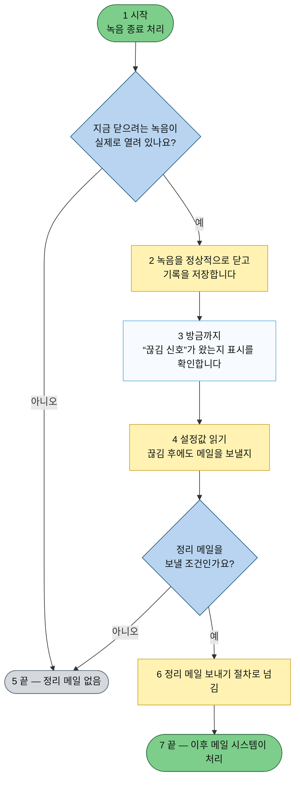
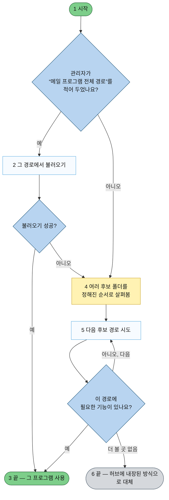
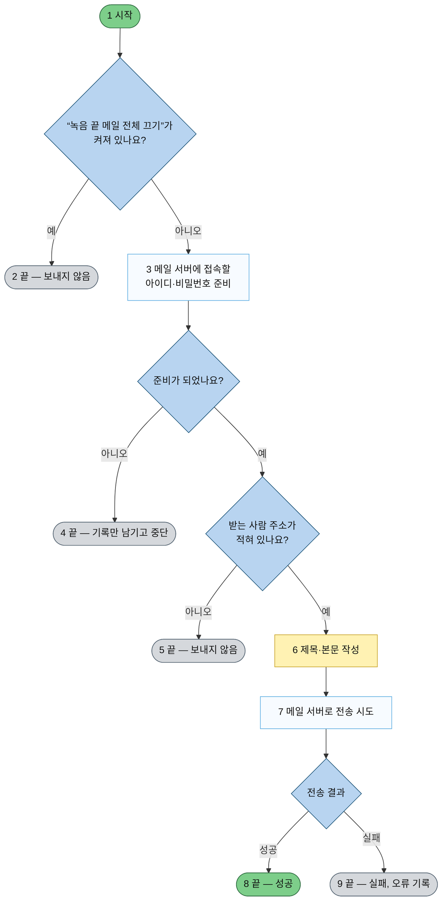
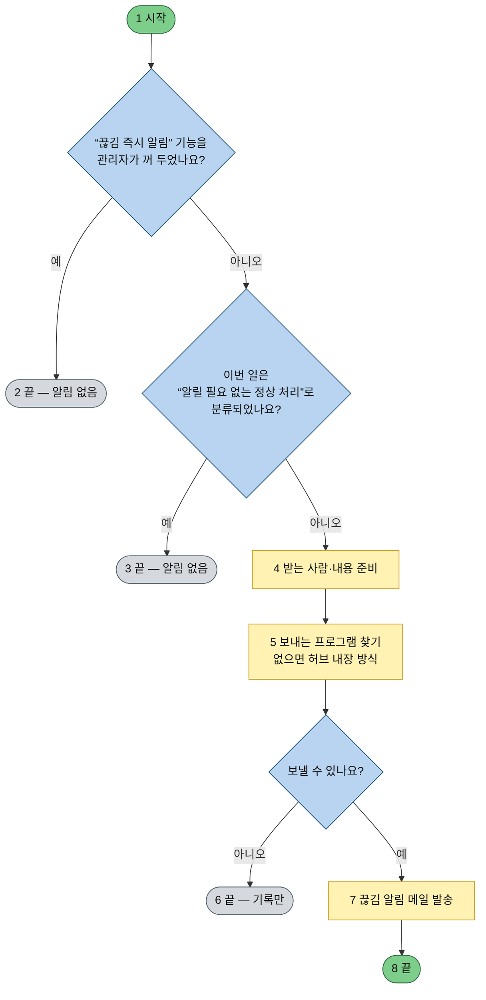
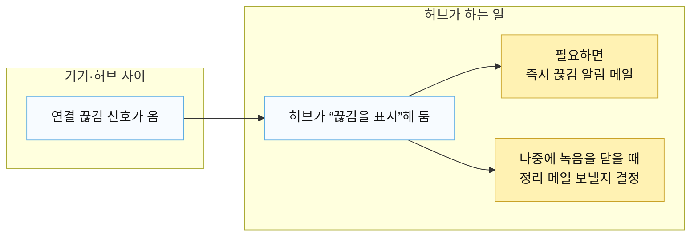

# 허브 녹음·연결 알림 메일 — 쉬운 설명서

개발자가 아닌 분도 **언제 어떤 메일이 가는지** 이해할 수 있도록 적었습니다.  
맨 아래에만 “설정 이름(영문)”을 적어 두었습니다. 운영·배포 담당자는 그 부분을 참고하면 됩니다.

---

## 한 줄로 먼저

허브는 크게 **두 종류**의 메일을 보낼 수 있습니다.

1. **갑자기 끊겼을 때 알림** — 측정 중이거나 녹음 중인데 연결이 끊긴 것 같을 때 **바로** 가는 메일입니다.  
2. **녹음 파일을 닫았을 때 요약** — 녹음이 **끝나고 파일을 정리**한 뒤에 가는 **정리 메일**입니다.

두 번째는 “끊김 신호를 받은 뒤에 닫았는지”에 따라 **보내지 않을 수도** 있습니다. (아래 표 참고)

---

## 그림에서 쓰는 색 (허브 설명서와 비슷하게)

| 색 | 뜻 |
|----|-----|
| **녹색 둥근 상자** | 시작했거나, 메일 발송까지 **무사히 끝난 경우** |
| **노란 상자** | 중요한 **단계** (지금 무슨 일을 하는 중인지) |
| **하늘색 마름모** | **질문** — 예 / 아니오 로 갈라짐 |
| **밝은 상자** | **실제로 하는 일** (조회, 작성, 보내기 등) |
| **회색 둥근 상자** | **메일을 보내지 않고 끝** (끔 설정, 조건 불충족, 오류로 조용히 중단 등) |

---

## ① 녹음이 끝난 뒤 — “정리 메일”을 보낼까?

**상황:** 반려동물 기기 쪽 **녹음이 종료**되어 허브가 녹음 기록을 닫을 때.

**핵심 질문 두 가지**

- 녹음이 열려 있는 동안 **“연결 끊김 신호(lost)”**를 한 번이라도 받았나요?  
- (받았다면) 관리자가 **“끊긴 뒤에 닫힌 경우에도 정리 메일을 받겠다”**고 켜 두었나요?



### “정리 메일” 조건을 표로만 보면

| 끊김 신호를 받고 녹음을 닫았나요? | “끊긴 뒤 닫힘에도 메일” 설정을 켰나요? | 정리 메일 |
|----------------------------------|----------------------------------------|----------|
| 아니오 (끊김 없이 닫힘) | 상관없음 | **보냄** (기본) |
| 예 | 끔 (기본) | **안 보냄** — 이미 “갑자기 끊김” 쪽 알림이 갔을 수 있음 |
| 예 | 켬 | **보냄** — 운영상 흐름을 글로도 남기고 싶을 때 |

**일상 말로:** “연결 끊김”은 나쁜 일처럼 들리지만, 시스템 입장에서는 **예상된 순서(끊김 알림 → 그다음 녹음 닫힘)**일 수 있습니다. 그래서 **같은 소식을 메일 두 통으로 보내지 않도록**, 끊긴 뒤 닫힌 경우에는 정리 메일을 **기본으로 생략**합니다. 꼭 글로도 받고 싶을 때만 설정으로 켭니다.

---

## ② 정리 메일을 보내기로 했다면 — 내부에서 하는 일

코드 이름 없이 순서만 적습니다.

```mermaid
flowchart TD
  P0([1 시작]):::start
  P1{관리자가<br/>“녹음 끝 메일 전체 끄기”를<br/>켜 두지 않았나요?}:::decision
  P2([2 끝 — 아무 메일도 안 보냄]):::terminal
  P3[3 누구에게 보낼지<br/>등록 정보에서 찾기]:::state
  P4[4 메일 안에 넣을<br/>짧은 기록(로그) 모으기]:::action
  P5[5 보내는 프로그램이<br/>어디에 있는지 찾기]:::state
  P6{허브 밖의 전용 파일이<br/>있나요?}:::decision
  P7[6 그 파일 방식으로 보냄]:::action
  P8[7 허브 안장된 같은 기능으로 보냄]:::action
  P9{보내기 함수를<br/>실제로 쓸 수 있나요?}:::decision
  P10([8 끝 — 기록만 남기고 중단]):::terminal
  P11[9 메일 작성 후 인터넷 메일로 발송]:::state
  P12([10 끝 — 발송 시도 완료]):::start

  P0 --> P1
  P1 -->|예, 끔| P2
  P1 -->|아니오| P3 --> P4 --> P5 --> P6
  P6 -->|예| P7 --> P9
  P6 -->|아니오| P8 --> P9
  P9 -->|아니오| P10
  P9 -->|예| P11 --> P12

  classDef start fill:#7dce8a,stroke:#2d6a3f,color:#111
  classDef state fill:#fff2b3,stroke:#c9a227,color:#111
  classDef decision fill:#b8d4f0,stroke:#1a5276,color:#111
  classDef action fill:#f7fbff,stroke:#5dade2,color:#111
  classDef terminal fill:#d5d8dc,stroke:#566573,color:#111
```

**메일 제목·본문에 적히는 “정상 / 비정상”**은 일상의 좋고 나쁨이 아니라, **“끊김 신호를 받은 뒤에 녹음이 닫혔는지”**를 구분하는 **내부 용어**에 가깝습니다. 운영 문서에는 그렇게 적어 두는 것이 좋습니다.

---

## ③ “보내는 프로그램”을 어디서 찾나요?

서버마다 폴더 이름이 다를 수 있어서, **먼저 지정한 경로**를 보고, 없으면 **자주 쓰는 위치**를 차례로 봅니다.



---

## ④ 메일을 실제로 보낼 때 — 막히는 지점

(전용 파일이든 허브 내장이든 **보내는 순서는 같습니다**.)



---

## ⑤ “갑자기 끊겼을 때” 메일 — 정리 메일과는 별개

**언제:** 측정·녹음 도중 **연결이 끊긴 것으로 판단될 때** (끊김 신호, 한동안 데이터 없음 등 — 허브 정책에 따름).

**정리 메일과의 관계:**  
설정으로 **끄고/켤 수 있는 스위치가 따로** 있습니다. 정리 메일을 꺼도, 이 “끊김 알림”만 켜 두는 식으로 운영할 수 있습니다.



---

## ⑥ 한눈에 — 끊김 신호 이후 두 갈래



---

## 개발·운영 담당자용 — 설정 이름 빠른 참고

| 일반인 설명서에서 쓴 말 | 설정 파일에 나오는 이름(영문) |
|------------------------|--------------------------------|
| 녹음 끝 “정리 메일” 전체 끄기 | `MONITOR_RECORDING_CLOSE_MAIL` = 0 또는 false |
| 끊긴 뒤 닫혀도 정리 메일 보내기 | `MONITOR_MAIL_ON_NORMAL_CLOSE` = 1 또는 true |
| 메일 프로그램 파일의 **정확한 위치** | `MONITOR_SEND_MAIL_CJS` |
| 메일 프로그램이 들어 있는 **폴더 이름만** 다를 때 | `MONITOR_MAIL_PACKAGE_DIR` |
| “갑자기 끊김” 즉시 알림 끄기 | `MONITOR_MEASURING_INTERRUPT_MAIL` = 0 또는 false |
| 메일 서버·받는 사람 등 | `MONITOR_SMTP_*`, `MONITOR_RECORDING_CLOSE_TO`, `NOTIFY_EMAIL` 등 — `hub/hub_project/back/.env.example` 표 참고 |

---

## 그림을 PNG로 저장하고 싶을 때

1. 이 파일 안의 **mermaid** 블록을 복사합니다.  
2. [mermaid.live](https://mermaid.live) 에 붙여 넣고 **PNG / SVG보내기**를 누릅니다.  
3. 회의 자료·운영 매뉴얼에 넣으면 됩니다.
